# Jaimin Bariya's Portfolio Website 🚀

Welcome to the open-source portfolio website of **Jaimin Bariya AKA Cloud Boy**! 🌟 This dynamic, privacy-focused, and user-friendly site is built to inspire both tech-savvy individuals and non-tech enthusiasts. Feel free to explore, use, and even fork this project. There are **no copyrights**—everyone has the right to copy, modify, and create their version! 😅


<br/>

## ✨ Key Features

1. **Open Source**: No restrictions—clone it, modify it, and make it your own. Just change the `data` files to customize the content. 🛠️

2. **Dynamic and Admin-Friendly**: The site is fully dynamic. It includes a hidden **dashboard page** that allows the admin to update content easily by modifying JavaScript object files. 📋

3. **Privacy-Centric**: 🔒
   - Access to the admin dashboard is secured by a **keyboard shortcut** that opens a dialog box.
   - Only admins with the correct password (matched against a **GitHub secret**) can access the dashboard.
   - Even if someone forks this project, they won't know the dashboard URL or password unless they change it.

4. **Easily Customizable Content**: The following data files in the project define all content:

   ```
   adminData.js
   adminDesc.js
   articlesData.js
   competeData.js
   educationData.js
   experienceData.js
   herosData.js
   miscellaneousData.js
   myBucketListData.js
   navbar.js
   imgSupplier.js
   projectsData.js
   quotesData.js
   ScreenTimeData.js
   siteMetaData.js
   startupData.js
   usagesData.js
   ```

   Just update these files to reflect new data on the site. ✍️

5. **Image Upload via Dashboard**: 🖼️
   - Upload images directly from the dashboard.
   - Images are stored in `frontend/src/assets/images` within the GitHub repo.
   - Add or update the image name in `imgSupplier` or other relevant data files to display it on the site.

6. **Frontend + Backend on GitHub**: This project runs both the **frontend** and **backend** logic using GitHub. How crazy is that? 🤯

7. **Secrets for Secure Deployment**: 🔑 The following secrets must be added to the GitHub repository:

   - `FIREBASE_AUTH_TOKEN`
   - `GOOGLE_APPLICATION_CREDENTIALS_JSON`
   - `VITE_ADMIN_DASHBOARD_URL`
   - `VITE_ENTRY_PASSWORD`
   - `VITE_GITHUB_REPO_TOCKEN`

   These ensure seamless functionality and privacy. 🛡️


<br/>
<br/>


## 📸 Features and Page Names with Screenshots

### 1. **Home Page** - *Dynamic and Engaging*
   - **Feature**: Displays real-time data from `herosData.js` and `siteMetaData.js`.
   - 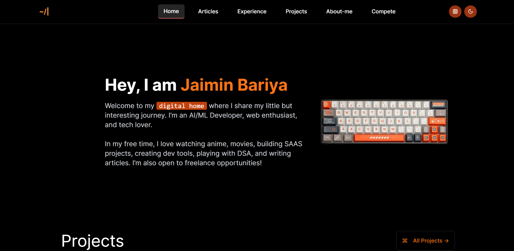
   - 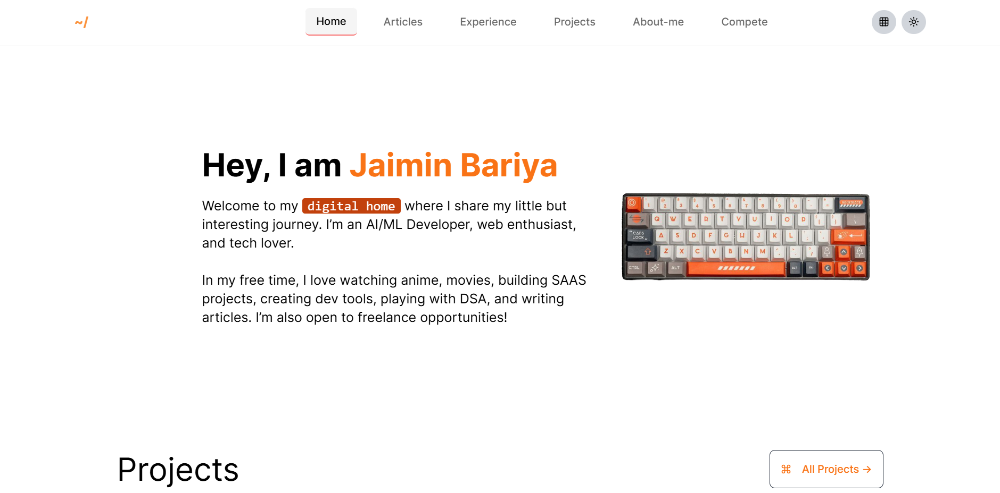

<br/>

### 2. **Projects Page** - *Showcase Your Work*
   - **Feature**: Pulls project details from `projectsData.js`.
   - 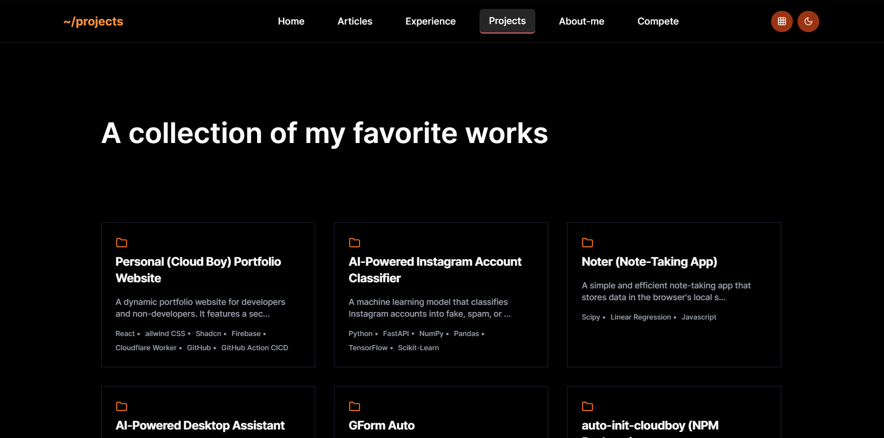

<br/>

### 3. **Experience Page** - *Highlight Professional Journey*
   - **Feature**: Displays job roles and achievements from `experienceData.js`.
   - 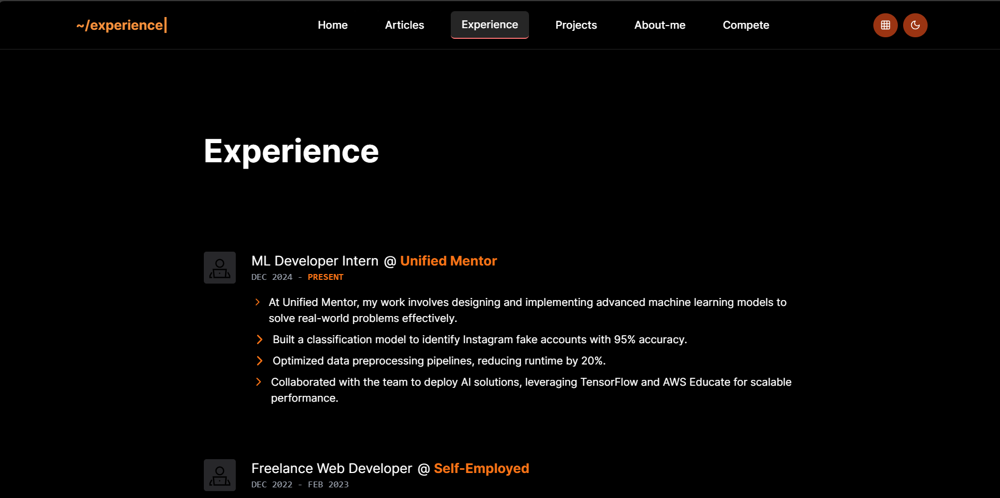

<br/>

### 4. **Bucket List Page** - *Personal Goals*
   - **Feature**: A fun way to showcase ambitions from `myBucketListData.js`.
   - 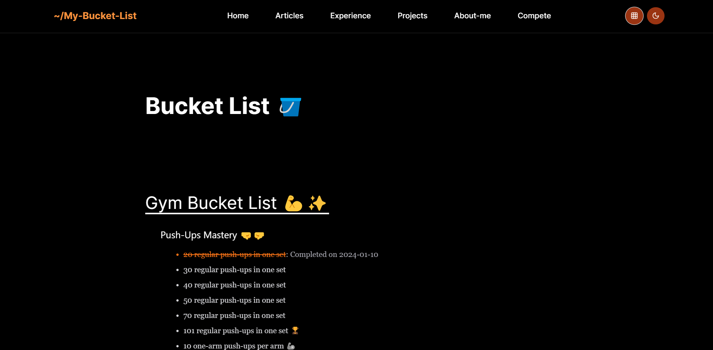

<br/>

### 5. **Four Tier Approach** - *Tech selection approach (my created one)*
   - 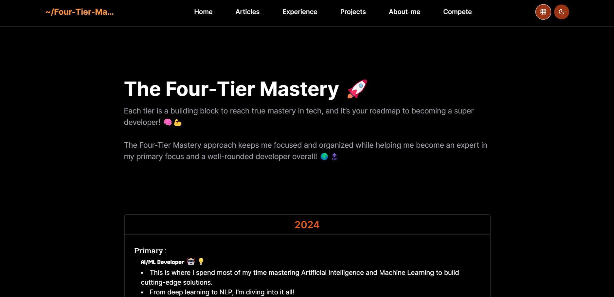

<br/>

### 6. **Mentor Page** - *Guidance, Favorite YT Channels and Res*
   - 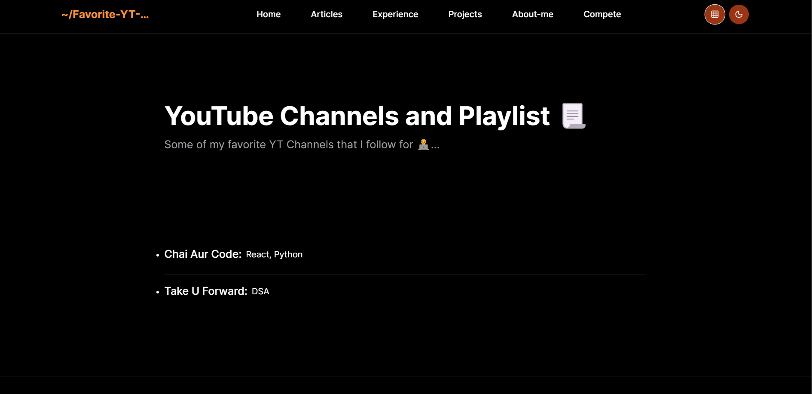

<br/>

### 7. **ScreenTime Chronicles Page** - *FV Movies, web series, and anime that inspire you*
   - 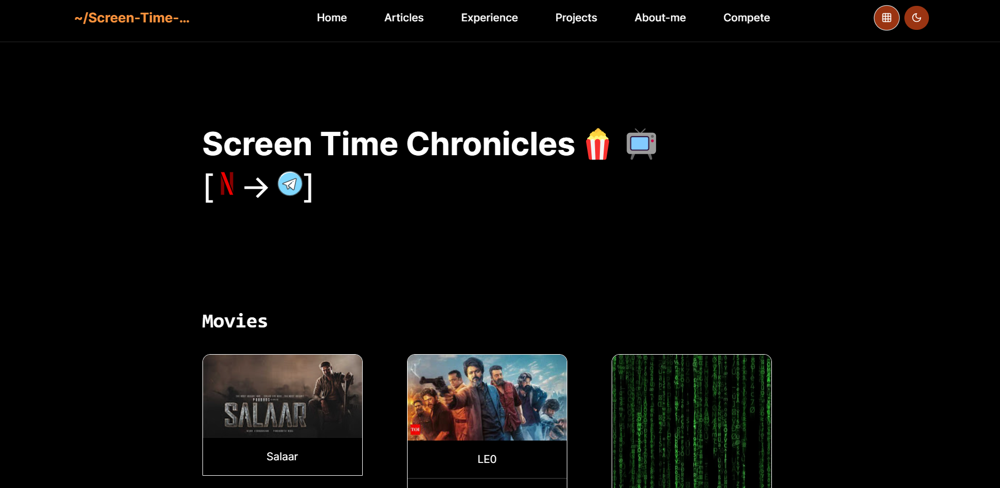

<br/>

### 8. **Compete and Conquer Page** - *Place to showcase your winning*
   - 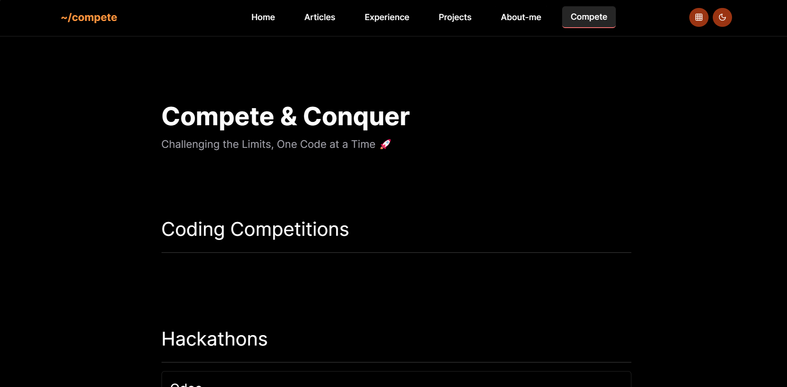

<br/>

### 9. **About-me Page** - *Personal Introduction Page*
   - 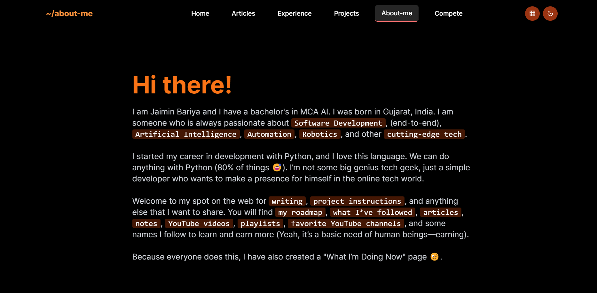

<br/>

### 10. **Articles Page** - *Your articles about tech and beyond*
   - 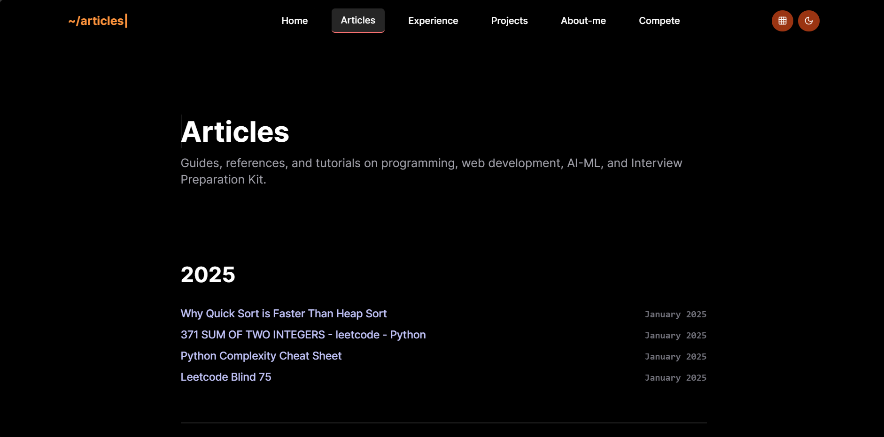

<br/>

### 11. **Dashboard Page** - *Admin Control Panel* *Secret page 🤫🤐🔐* 
   - **Feature**: Admin-only access with password verification.
   - **Feature**: Upload images and update content files directly.
   - 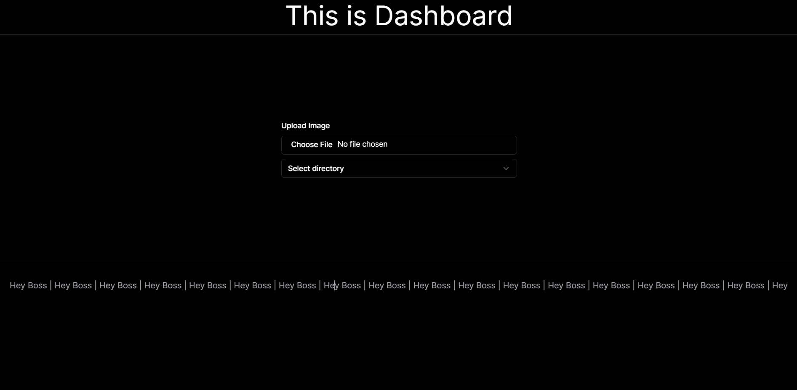

<br/>

### 12. **Editor Page** - *Admin DataFiles Update Panel* *Secret page 🤫🤐🔐* 
   - **Feature**: Admin-only update with password verification.
   - **Feature**: Update Data Files.
   - 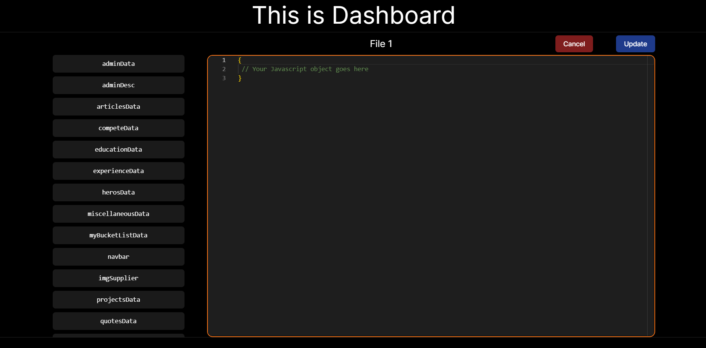


<br/>


## 🚀 How to Get Started

1. Clone the repository:
   ```bash
   git clone https://github.com/jaimin-bariya/portfolio-website.git
   ```

2. Install dependencies:
   ```bash
   npm install
   ```

3. Add required secrets to your GitHub repository. 🔑

4. Run the development server:
   ```bash
   npm run dev
   ```

5. Customize the `data` files and enjoy your personalized portfolio! 🎉

---

<br/>


## 📜 License

This project is open source and available under **no copyright**. Use it as you wish—everyone has the right to copy and modify! 😅

---

<br/>


🌐 Explore the live site: [Jaimin Bariya's Portfolio](https://jaimin-bariya.web.app/)
